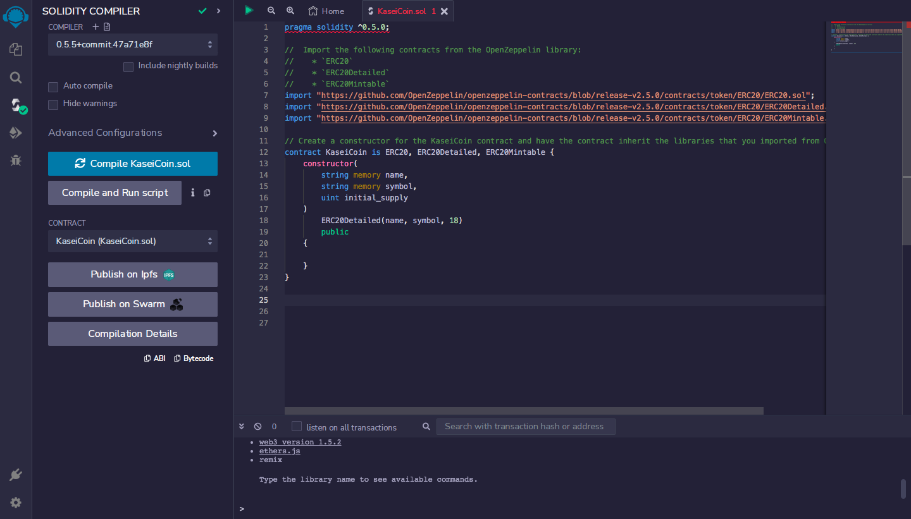

# Module_21_Challenge_Tokenomics

## Background
After waiting for years and passing several tests, you were selected by the Martian Aerospace Agency (a fictitious organization) to become part of the first human colony on Mars. As a prominent fintech professional, you were chosen to lead a project developing a monetary system for the new colony. You decide to base this new system on blockchain technology and to define a new cryptocurrency, named KaseiCoin. (Kasei means Mars in Japanese.)

KaseiCoin will be a fungible token that’s ERC-20 compliant. You’ll launch a crowdsale that will allow people who are moving to Mars to convert their earthling money to KaseiCoin.

## What You're Creating
A fungible token that’s ERC-20 compliant and that will get minted via a crowdsale contract that you create based on the Crowdsale contract from the Solidity library.

A crowdsale contract that you create, which manages the entire crowdsale process. Specifically, it will allow users to send ether to the contract and receive KAI, or KaseiCoin tokens, in return. Your contract will automatically mint the tokens and distribute them to buyers in one transaction.

Either a short video or a set of screenshots that illustrates your work for each subsection of the Challenge. You should place this in the Evaluation Evidence section of the README.md file in your GitHub repository for this Challenge.

### Instructions
The high-level steps for this Challenge are as follows:

Create the KaseiCoin token contract.

Create the KaseiCoin crowdsale contract.

Create the KaseiCoin deployer contract.

Deploy the crowdsale to a local blockchain.

Optional: Extend the crowdsale contract by using OpenZeppelin.

---

